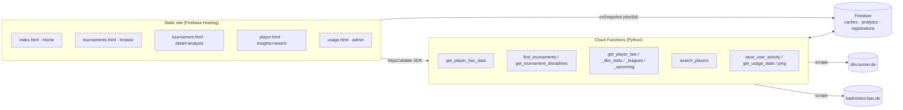

# BAX Checker — Architecture Overview

> A free, non‑commercial tool that scouts German badminton **tournaments** (rank
> every entered team/player by their **BAX** rating for any discipline) and gives
> a **player‑focused** view (BAX history, relative standing, leagues, tournaments,
> titles, win/loss and upcoming registrations). Live at
> [baxcheck.de](https://baxcheck.de) (Firebase project `creative-workspace-359a0`).

BAX is the official rating system of the Deutscher Badminton‑Verband. The app owns
no data of its own — it **scrapes** two public upstreams on demand and **caches**
the results in Firestore.

---

## 1. Tech stack

| Layer | Technology |
|---|---|
| Frontend | Static multi‑page site (vanilla HTML/CSS/JS, ES modules). No framework, no bundler. |
| Charts | Hand‑rolled **inline SVG** (no chart library). |
| Icons / fonts | Lucide (CDN), Inter (Google Fonts). |
| Backend | **Firebase Cloud Functions, Python 3.12** (`firebase-functions`), one callable per feature. |
| Scraping | `requests` (pooled session) + `BeautifulSoup` (`html.parser`); `pandas` for group aggregation. |
| Data / cache | **Cloud Firestore** (Admin SDK; bypasses security rules). |
| Auth | Firebase Auth (Google sign‑in) — optional; the tools work anonymously. |
| Hosting | Firebase Hosting (static) + Hosting rewrites. |

Only two external frontend dependencies are ever loaded: the Firebase Web SDK
(gstatic ESM) and Lucide. Everything else is self‑contained.

---

## 2. Repository layout

```
creative-workspace/
├── firebase.json            # hosting rewrites, functions codebase, emulator ports
├── firestore.rules          # client can read only users/{uid} + jobs/{jobId}
├── firestore.indexes.json   # composite index: player_registrations(profile_id, start_date)
├── firebase-dev.sh          # emulator / deploy convenience script
├── functions/               # Python Cloud Functions (the backend)
│   ├── main.py              # re-exports every callable (deploy names = __name__)
│   ├── requirements.txt     # requests, beautifulsoup4, pandas, firebase-functions…
│   └── app/                 # see §4 — three subpackages, no domain module lives loose
│       ├── core/            # infra only: no callables, no scraping
│       ├── scraping/        # every dbv.turnier.de / badminton-bax.de feature + its callables
│       └── platform/        # non-scraping callables: accounts, admin dashboard, health
├── public/                  # the static site (Firebase Hosting root)
│   ├── html/                # pages (index, player, tournament(s), + components/)
│   ├── js/                  # page scripts + js/util/ (firebase, auth, theme)
│   └── styles/              # main.css (tokens + nav + shared) + bax_checker.css + player.css
└── knowledge/               # docs (this file)
```

---

## 3. High‑level architecture



- The frontend calls the backend exclusively through the **Firebase callable SDK**
  (`httpsCallable`) — there are no REST endpoints or hard‑coded URLs.
- Long analyses stream progress by writing a `jobs/{jobId}` doc that the browser
  watches with `onSnapshot` (the only Firestore collection the client reads live).
- All scraping and all cache/analytics writes happen in the backend (Admin SDK).

---

## 4. Backend (`functions/app/`)

`main.py` imports and re‑exports the callables; the deployed function name is each
callable's Python `__name__` (unaffected by which folder the module lives in), and
the frontend calls them by that exact string. Every internal import is absolute
(`from app.<pkg>.<module> import ...`), never relative, matching the app's one
existing convention.

`app/` has three subpackages:
- **`core/`** — technical infra only. No callables, no dbv/bax business logic;
  would look the same if this app were about something else entirely.
- **`scraping/`** — every dbv.turnier.de / badminton‑bax.de feature and its
  callable(s). These modules import each other freely (e.g. `player.py` pulls
  from `bax.py`, `leagues.py`, `tournaments.py`).
- **`platform/`** — non‑scraping callables (accounts, admin dashboard, health).
  Only ever import from `core/`, never from `scraping/`.

### Callables

| Callable | Module | Purpose | Auth |
|---|---|---|---|
| `get_player_bax_data` | `scraping/bax.py` | The core analysis: scrape a discipline's entry list, then per‑player identity + BAX + leagues (concurrent), return teams grouped by starting group. Also fires the **implicit registration capture**. | none (rate‑limited) |
| `find_tournaments` | `scraping/tournaments.py` | Search dbv tournaments (POST `/find/tournament/DoSearch`). | none |
| `get_tournament_disciplines` | `scraping/tournaments.py` | A tournament's disciplines + its **name/dates** (for bare shareable links). | none |
| `get_tournament_winners` | `scraping/tournaments.py` | Final placements per discipline once published. | none |
| `get_player_leagues` | `scraping/leagues.py` | Per‑season league memberships/records (also reused inside the analysis and the network feature). | none |
| `get_player_network` | `scraping/network.py` | Teammates/opponents aggregated from tournament + league match history. | none |
| `get_player_bax` | `scraping/player.py` | Identity + full per‑season **BAX history** + **LV/DBV standing histograms** (badminton‑bax.de). | none |
| `get_player_dbv_stats` | `scraping/player.py` | Career/season **win‑loss**, **titles/finals** (with podium `place`), **tournaments played** (dbv). | none |
| `get_player_upcoming` | `scraping/player.py` | Tournaments a player is currently registered for — merges the implicit `player_registrations` capture with a direct read of the player's own league page(s) for tournaments nobody's analysed yet (players with no league get only the former). | none |
| `search_players` | `scraping/player.py` | dbv **player search** (`/find/player?q=`) → candidates with both ids + club. | none |
| `get_club_roster` | `scraping/clubs.py` | Resolve a club by free-text name (or an already-known `cl_code`) and return its roster — Name, gender, birth year, W/L, win rate, BAX — for one season across Einzel/Doppel/Mixed (badminton-bax.de's `bax-portal/verein`), plus an `active_players` count (played ≥1 match). | none |
| `get_club_teams` | `scraping/clubs.py` | **One season's** worth of a club's teams + real league standings (`slot`: 0 = current, 1/2 = that many seasons back) — **derived** (no direct upstream endpoint): resolves the roster's players to dbv profiles, reuses `leagues._scrape_leagues` to find their teams, then fetches each team's actual standings page. Cost scales with roster size — tighter rate limit than the lookups above. | none |
| `save_user_activity` | `platform/accounts.py` | Upsert `users/{uid}` on login. | required |
| `get_usage_stats` | `platform/admin.py` | Admin usage dashboard aggregation. | required + admin allow‑list |
| `ping` | `platform/health.py` | Health check. | none |

### `core/` — infra
- **`common.py`** — the shared scraping layer: `BASE` (dbv), a pooled thread‑safe
  `requests.Session` with retries, the browser `HEADERS`, and the magic
  `COOKIES={"st": …}` that gets past dbv's consent wall. `_get()` is the single GET
  choke‑point.
- **`auth.py`** — `rate_key(req)` (uid or IP), `authenticate_user`, `now_ms`.
- **`rate_limiting.py`** — in‑process sliding window (`check_rate_limit`) + a
  Firestore‑transaction distributed limiter.
- **`firebase_app.py`** — Admin SDK init; `db` is `None` if init fails (memory‑cache
  fallback) and `set_global_options` (max_instances=10, timeout 540s, 512 MB).
- **`cache_config.py`** — every cache's freshness constant in one place (see below) —
  tune a cache by editing the value here, nothing else needs to change.

### `scraping/` — the feature modules
- **`analytics.py`** — best‑effort usage counters (`bump_summary`, `bump_entity`),
  the implicit `record_registrations` + `player_index` upsert, `name_key`, and
  `parse_event_url`. Consumed by every other scraping module, not scraping-specific
  itself.
- **`bax.py`, `tournaments.py`, `leagues.py`, `network.py`, `player.py`,
  `clubs.py`** — one module per feature; see the callables table above for
  what each owns.

### Caching & invalidation
Every upstream fetch is cached in Firestore, with the TTL for each pulled from
**`core/cache_config.py`** rather than hardcoded inline. Two caches key off
badminton‑bax.de's index page's **"Stand der Aktualisierung"** dates instead of a
timer, so entries stay valid until the source actually recomputes (the TTL below is
only the fallback used when that date can't be read):

| Cache collection | Key | Freshness | `cache_config.py` constant |
|---|---|---|---|
| `tournament_search_cache` | md5(filters) | 12 h | `TOURNAMENT_SEARCH_TTL` |
| `tournament_disciplines_cache` | tournament GUID | 24 h (+ name/dates) | `TOURNAMENT_DISCIPLINES_TTL` |
| `tournament_winners_cache` | tournament GUID | 14 d if resolved, else 2 h | `TOURNAMENT_WINNERS_RESOLVED_TTL` / `_UNRESOLVED_TTL` |
| `player_profile_cache` | md5(profile_url) | 1 day | `PLAYER_PROFILE_TTL` |
| `tournament_player_card_cache` | md5(player.aspx URL) | 12 h | `TOURNAMENT_PLAYER_CARD_TTL` |
| `bax_values_cache` | sp_code | valid while `= "(Turniere)"` date; 30 d fallback | `BAX_VALUES_FALLBACK_TTL` |
| `player_bax_cache` | sp_code | valid while `= "(Turniere)"` date; 30 d fallback | `PLAYER_BAX_FALLBACK_TTL` |
| `player_leagues_cache` | `{profile_id}_{year}` | valid while `= "(Ligen)"` date; 60 d fallback | `PLAYER_LEAGUES_FALLBACK_TTL` |
| `league_player_page_cache` | md5(league match URL) | 12 h | `LEAGUE_PLAYER_PAGE_TTL` |
| `player_dbv_stats_cache` | profile_id | 12 h | `PLAYER_DBV_STATS_TTL` |
| `player_search_cache` | md5(q) | 12 h | `PLAYER_SEARCH_TTL` |
| `entrylist_cache` | md5(entry-list URL) | 12 h | `ENTRYLIST_TTL` |
| `player_network` | profile_id | 24 h | `PLAYER_NETWORK_TTL` |
| `club_search_cache` | md5(query) | 12 h | `CLUB_SEARCH_TTL` |
| `club_roster_cache` | `{cl_code}_{season or 'current'}` | valid while `= "(Turniere)"` date; 30 d fallback | `CLUB_ROSTER_FALLBACK_TTL` |
| `club_teams_cache` | `{cl_code}_{slot}` | valid while `= "(Ligen)"` date; 60 d fallback | `CLUB_TEAMS_FALLBACK_TTL` |
| `team_standing_cache` | `{league_guid}_{team_id}` | 12 h | `TEAM_STANDING_TTL` |

`_bax_update_date()` / `_leagues_update_date()` read the front page, memoized
in‑process for `BAX_DATE_CHECK_SECONDS` / `LIGEN_DATE_CHECK_SECONDS` (600s each).
A `force` flag on the scraping callables bypasses caches (tightly rate‑limited).

---

## 5. Player key model

Every player has **two identifiers**, and the app keeps them mapped:

- **`sp_code`** (`NN-NNNNNN`) → badminton‑bax.de (BAX ratings, history, distribution).
- **`profile_id`** (36‑char GUID) → dbv.turnier.de (leagues, tournaments, titles, W/L).

Both are resolved together during any tournament analysis (`get_player_details`) and
in `search_players` results, and stored in **`player_index`** (`profile_id` →
`{sp_code, name, name_key}`). This lets a name search light up the dbv‑only sections
and reuse the BAX cache. `name_key` is an order‑independent sorted‑token key so the
badminton‑bax.de `(surname, firstname)` form and dbv's `First Last` form resolve to
one another.

---

## 6. Frontend (`public/`)

Static multi‑page site — **no client router**. Firebase Hosting serves the static
files directly; rewrites: `/` → `index.html`, and `**` → `index.html` as a fallback.
`tournament.html?id=…&event=…` etc. are plain static pages driven by query params, so
they are directly **shareable**.

### Pages
| Page | Role |
|---|---|
| `html/index.html` | **Home** — hero + two entry cards (Tournaments / Players). |
| `html/tournaments.html` | **Tournaments browse** — filters (collapsible) + result cards → tournament page. |
| `html/tournament.html` | **Tournament detail** — disciplines + BAX analysis (table/chart); `?id=&event=` deep‑links + Share. |
| `html/player.html` | **Player insights** — name search (results list) + profile with sticky sub‑nav tabs. |
| `html/club.html` | **Club overview** — name search (+ disambiguation list) → roster (BAX/win‑rate per season/discipline) and derived team league‑ranking history. |
| `html/components/bax_checker/usage.html` | Admin usage dashboard. |
| `impressum.html` / `privacy.html` | Legal pages. |
| `html/components/bax_checker/bax_checker.html` | Legacy — now a redirect to `tournaments.html`. |

`components/bax_checker/{analytics,profile,settings}.html` are empty placeholder stubs.

### Shared chrome & conventions
- **Persistent top nav** (`.site-nav`, a centered pill: Tournaments | Players) is
  static markup repeated in every page, styled in `main.css`; auth button + theme
  toggle + admin‑only Usage link live in it.
- **`js/util/firebase.js`** initializes the SDK once and connects to emulators on
  localhost. **`auth.js`** = Google sign‑in + `authchange` event + admin usage‑link
  toggle. **`theme.js` / `themeInit.js`** = light/dark theme (pre‑paint, no flash).
- **Design tokens** live as CSS custom properties in `main.css` (light default =
  teal accent, dark = violet), with three theme states (system / `data-theme`).
- **Charts** are hand‑built inline SVG (BAX bar chart, multi‑line history, distribution
  histogram, usage timeline) coloured from CSS vars, so they recolor on theme toggle.
- Result convention: callables return `{ data: {...} }`; errors surface as
  `result.data.error` (a string the page throws).

### Page scripts
`tournaments.js`, `tournament.js`, `player.js`, `club.js`, `usage.js`. (`bax_checker.js` is the
retired predecessor of the tournament scripts — still on disk, no longer referenced.)

---

## 7. Firestore data model

Client‑readable via rules: **only** `users/{uid}` (own) and `jobs/{jobId}`. Everything
else is backend‑only (served through callables).

| Collection | Shape / purpose |
|---|---|
| `users/{uid}` | Account profile (name, email, loginCount, timestamps). |
| `jobs/{jobId}` | Live analysis progress (`status`, `total_players`, `processed_players`). |
| `rateLimits/{uid_action}` | Distributed rate‑limit counters. |
| `usage/summary` | Aggregate counters (`{field}_authed/_anon/_total`). |
| `usage_daily/{YYYY-MM-DD}` | Per‑day action counts (authed/anon). |
| `usage_tournaments/{tid}`, `usage_disciplines/{tid__event}`, `usage_players/{profileId}` | Per‑entity query counters (via `bump_entity`). |
| `*_cache` (see §4) | Scrape caches. |
| `player_index/{profile_id}` | `sp_code ↔ profile_id ↔ name` mapping. |
| `player_registrations/{profile_id__tid__event}` | **Implicit capture**: player X is registered for tournament Y, discipline Z (with link + start_date). Powers Upcoming. |

The only composite index (`firestore.indexes.json`) is
`player_registrations(profile_id ASC, start_date ASC)`; everything else uses
single‑field / automatic indexes.

---

## 8. Upstream data sources & quirks

**dbv.turnier.de** (Tournament Software):
- Requires the `COOKIES={"st": …}` cookie (in `common.py`) to bypass the consent wall.
- Tournament search = POST `/find/tournament/DoSearch`; disciplines = `sport/events.aspx`;
  entry lists = `sport/event.aspx`; player profile = `/player-profile/{guid}`
  (+ `/leagues`, `/tournaments`); **Titles/Finals** = XHR `…/PersonHome/TitlesFinals`;
  **player search** = `/find/player?q=` (name substring match, returns cards with the
  profile GUID **and** the `(sp_code)` and club).
- A player's `sp_code` and `profile_id` (GUID) are both extractable; the GUID often
  hides behind a tournament‑scoped `/player/<guid>/<b64>` link that 302‑redirects to
  the real `/player-profile/<guid>`.

**badminton-bax.de** (`spieler-entwicklung`):
- The `sp_code` is the key. The by‑name page exposes it only in a hidden form input.
- The **relative‑standing histograms** (`zum_dia_lv` / `zum_dia_dbv`) only render
  after the player has been loaded in the **same** `requests.Session` (session state).
- The front‑page "Stand der Aktualisierung … (Turniere) / (Ligen)" dates drive cache
  invalidation.
- **Club lookup** (`index.php/bax-portal/verein?verein=<name>&verein_start=anzeigen`):
  a real club search that returns a season/discipline roster (Name, W/L, BAX,
  plus whichever optional columns are checked) once a name resolves
  uniquely, or a "Bitte auswählen!" list of `cl_code` candidates when it
  doesn't (resubmit with `cl_code=<chosen>&zeig_verein=anzeigen`). `cl_code`
  (e.g. `01-0406`) is the same code dbv shows on its own club page title. The
  *current* season is always read back from the page's own header — its
  cutover doesn't line up with a simple calendar guess. **Optional columns**
  (SpielerID/Jahrgang off, Alt/Niveau/Erfolg on by default) only change if
  the request submits the `neu_liste` ("aktualisieren") button together with
  the desired `check_*_v=on` set — `verein_start`/`zeig_verein` always
  render the site's own defaults regardless of what `check_*_v` params are
  passed. `clubs.py` always requests `neu_liste` + Jahrgang/Alt/Erfolg (no
  Niveau) to get birth year instead of the internal seeding number. Note:
  **dbv itself has no equivalent** —
  `dbv.turnier.de/find/club` is a tournament‑*organizer* search ("Ausrichter"),
  not a participant‑club one, so a club's teams/league‑standings are derived
  (see `clubs.py`) by resolving the roster's players to dbv profiles and
  reusing the per‑player league scrape, not scraped directly.

---

## 9. Key flows

**Tournament analysis** (`get_player_bax_data`)
1. Scrape the discipline entry list → unique player links.
2. Concurrently, per player: resolve identity (`sp_code` + GUID) → BAX values
   (badminton‑bax.de) → league tags (dbv). Progress written to `jobs/{jobId}`.
3. Aggregate into teams (per starting group) with summed BAX via pandas; return.
4. **Best‑effort side‑effect**: `record_registrations` writes one
   `player_registrations` doc per player+discipline and upserts `player_index`.

**Player profile** (`player.html`) — progressive, tab‑based:
`get_player_bax` (identity/history/distribution) + `get_player_dbv_stats`
(win‑loss/titles/tournaments) + `get_player_leagues` + `get_player_upcoming`. Arriving
from a tournament passes `from_*` params → a "back to tournament" button + dbv
tournament‑player link.

**Player search** (`search_players`) → clickable list; each result carries both ids →
opens a full profile.

**Upcoming** = read‑back of `player_registrations` (filtered to today‑or‑later), merged
with a direct read of the player's own current league page(s) — the "Turniere mit
`<Name>`" widget on `/league/<lg>/player/<n>` — for any tournament nobody's analysed
on the site yet. The latter only exists for a player with at least one league this
season; see §11.

**Club overview** (`club.html`) — `get_club_teams(slot=0)` (current season) is
fired eagerly right after resolution, not just on a Teams-tab click, since
its result also drives the identity card's stat tiles; `slot=1`/`2` (prior
seasons) are fetched only when their column is clicked in the Teams tab:
1. `get_club_roster` resolves the club (free‑text name, or a stored `cl_code`)
   and returns one season's Einzel/Doppel/Mixed roster from badminton‑bax.de,
   rendered split by gender (Women/Men side by side), plus `active_players`.
2. `get_club_teams` resolves every rostered name to a dbv `profile_id` (via
   `player_index`, falling back to a live dbv name search — skipping rather
   than guessing on an ambiguous common surname) and reuses
   `leagues._scrape_leagues` per resolved player to find which teams they're
   on for the requested slot. A player's own per‑league "PL n"/record from
   `_scrape_leagues` is shared across every division/team on their `/leagues`
   page (see leagues.py), so it's **not** trustworthy per‑team once a league
   spans more than one team — instead, each distinct (league_guid, team_id)
   division's *own* standings page (`sport/league/team`) is fetched for its
   real rank + match win/draw/loss (`_fetch_team_standing`). Two filters drop
   noise before that fetch: a division needs a real team link (drops a rare
   individual‑event entry `leagues.py` can mis‑parse as a pseudo‑league), and
   the team name must actually start with the club's own name (drops a
   misresolved same‑name‑different‑person match's unrelated team — see
   `_belongs_to_club`). The frontend renders this as a team × season heatmap
   (color = league tier, direct‑labeled with the tier tag, rank and
   win‑draw‑loss record) and derives the top‑of‑page "Teams" / "Best rank"
   stat tiles from slot 0 only, regardless of which other seasons have since
   been loaded. See §11 for the coverage gap this implies, and for a
   transitional cache-schema note.

---

## 10. Development & deployment

Everything runs through **`firebase-dev.sh`** (needs `FIREBASE_TOKEN` +
`GOOGLE_APPLICATION_CREDENTIALS`):

```bash
./firebase-dev.sh start-emulators   # hosting:5000 functions:5001 firestore:8080 auth:9099 ui:4000
./firebase-dev.sh deploy-all        # or deploy-functions / deploy-hosting
```

- Python deps live in `functions/venv` (3.12). Hosting serves `public/` live (no build).
- After schema changes, deploy the Firestore index:
  `firebase deploy --only firestore:indexes`.
- Admin (usage dashboard) is a hardcoded email allow‑list in `platform/admin.py`; on
  the emulator any signed‑in account is treated as admin.

---

## 11. Known limitations & future work

- **Upcoming coverage still has a gap.** dbv's per‑player profile only lists *played*
  tournaments by year — the only place it lists *upcoming* ones is a player's own
  league "Spielübersicht" page (`league/<lg>/player/<n>`, the "Turniere mit `<Name>`"
  widget), which only exists for a player with at least one league membership this
  season. `get_player_upcoming` uses that plus the implicit `player_registrations`
  capture (tournaments analysed on the site), so a player with **no** league and whose
  tournaments nobody's analysed yet still shows nothing. A scheduled crawler (walk
  registration‑open tournaments → their entry lists → write `player_registrations`)
  would be the way to close that remaining gap.
- **`public/js/bax_checker.js` is orphaned** (superseded by `tournaments.js` +
  `tournament.js`); safe to delete in a follow‑up.
- **Club teams coverage depends on name resolution.** `get_club_teams` only
  finds a team for roster players it can resolve to a dbv `profile_id`
  (`player_index`, else a live name search) — a never‑before‑seen player with
  a common surname and no distinguishing club match on dbv is skipped rather
  than guessed at, so a club with many unresolvable names will under‑report
  its teams. Once a player is looked up anywhere on the site (profile view,
  tournament analysis), they resolve for free from then on.
- **`player_leagues_cache` schema transition.** `leagues._scrape_leagues`'s
  division dicts gained `team_id`/`league_guid` (needed by `clubs.py`'s real
  per‑team standings fetch) as an additive field, but an already‑cached entry
  from before that change stays "fresh" (per its `ligen_date`) without those
  keys until it naturally expires or the site's Ligen date rolls over —
  until then, `get_club_teams` silently drops that player's divisions (no
  `team_id` to fetch a standing with). Affects only entries cached before
  this change shipped; self‑heals as caches roll over, or immediately per
  entry via a `force` re-scrape.
- **Distribution parsing** depends on badminton‑bax.de's exact HTML (table of
  `td.sauleBack` frequency bars) and needs the session‑state trick — the most fragile
  scraper.
- Scraping is polite but unauthenticated; both upstreams can change markup at any time,
  which is why every parser degrades gracefully and caches aggressively.
