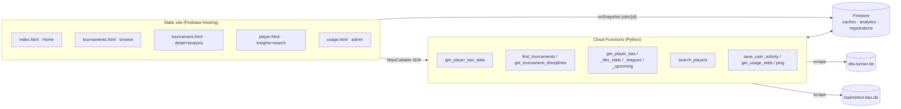

# BAX Checker — Architecture Overview

> A free, non‑commercial tool that scouts German badminton **tournaments** (rank
> every entered team/player by their **BAX** rating for any discipline) and gives
> a **player‑focused** view (BAX history, relative standing, leagues, tournaments,
> titles, win/loss and upcoming registrations). Live at
> [baxcheck.de](https://baxcheck.de) (Firebase project `creative-workspace-359a0`).

BAX is the official rating system of the Deutscher Badminton‑Verband. The app owns
no data of its own — it **scrapes** two public upstreams on demand and **caches**
the results in Firestore.

---

## 1. Tech stack

| Layer | Technology |
|---|---|
| Frontend | Static multi‑page site (vanilla HTML/CSS/JS, ES modules). No framework, no bundler. |
| Charts | Hand‑rolled **inline SVG** (no chart library). |
| Icons / fonts | Lucide (CDN), Inter (Google Fonts). |
| Backend | **Firebase Cloud Functions, Python 3.12** (`firebase-functions`), one callable per feature. |
| Scraping | `requests` (pooled session) + `BeautifulSoup` (`html.parser`); `pandas` for group aggregation. |
| Data / cache | **Cloud Firestore** (Admin SDK; bypasses security rules). |
| Auth | Firebase Auth (Google sign‑in) — optional; the tools work anonymously. |
| Hosting | Firebase Hosting (static) + Hosting rewrites. |

Only two external frontend dependencies are ever loaded: the Firebase Web SDK
(gstatic ESM) and Lucide. Everything else is self‑contained.

---

## 2. Repository layout

```
creative-workspace/
├── firebase.json            # hosting rewrites, functions codebase, emulator ports
├── firestore.rules          # client can read only users/{uid} + jobs/{jobId}
├── firestore.indexes.json   # composite index: player_registrations(profile_id, start_date)
├── firebase-dev.sh          # emulator / deploy convenience script
├── functions/               # Python Cloud Functions (the backend)
│   ├── main.py              # re-exports every callable (deploy names = __name__)
│   ├── requirements.txt     # requests, beautifulsoup4, pandas, firebase-functions…
│   └── app/                 # one module per domain (see §4)
├── public/                  # the static site (Firebase Hosting root)
│   ├── html/                # pages (index, player, tournament(s), + components/)
│   ├── js/                  # page scripts + js/util/ (firebase, auth, theme)
│   └── styles/              # main.css (tokens + nav + shared) + bax_checker.css + player.css
└── knowledge/               # docs (this file)
```

---

## 3. High‑level architecture



- The frontend calls the backend exclusively through the **Firebase callable SDK**
  (`httpsCallable`) — there are no REST endpoints or hard‑coded URLs.
- Long analyses stream progress by writing a `jobs/{jobId}` doc that the browser
  watches with `onSnapshot` (the only Firestore collection the client reads live).
- All scraping and all cache/analytics writes happen in the backend (Admin SDK).

---

## 4. Backend (`functions/app/`)

`main.py` imports and re‑exports the callables; the deployed function name is each
callable's Python `__name__`, and the frontend calls them by that exact string.

### Callables

| Callable | Module | Purpose | Auth |
|---|---|---|---|
| `get_player_bax_data` | `bax.py` | The core analysis: scrape a discipline's entry list, then per‑player identity + BAX + leagues (concurrent), return teams grouped by starting group. Also fires the **implicit registration capture**. | none (rate‑limited) |
| `find_tournaments` | `tournaments.py` | Search dbv tournaments (POST `/find/tournament/DoSearch`). | none |
| `get_tournament_disciplines` | `tournaments.py` | A tournament's disciplines + its **name/dates** (for bare shareable links). | none |
| `get_player_leagues` | `leagues.py` | Per‑season league memberships/records (also reused inside the analysis). | none |
| `get_player_bax` | `player.py` | Identity + full per‑season **BAX history** + **LV/DBV standing histograms** (badminton‑bax.de). | none |
| `get_player_dbv_stats` | `player.py` | Career/season **win‑loss**, **titles/finals**, **tournaments played** (dbv). | none |
| `get_player_upcoming` | `player.py` | Tournaments a player is currently registered for (from `player_registrations`). | none |
| `search_players` | `player.py` | dbv **player search** (`/find/player?q=`) → candidates with both ids + club. | none |
| `save_user_activity` | `accounts.py` | Upsert `users/{uid}` on login. | required |
| `get_usage_stats` | `admin.py` | Admin usage dashboard aggregation. | required + admin allow‑list |
| `ping` | `health.py` | Health check. | none |

### Support modules
- **`common.py`** — the shared scraping layer: `BASE` (dbv), a pooled thread‑safe
  `requests.Session` with retries, the browser `HEADERS`, and the magic
  `COOKIES={"st": …}` that gets past dbv's consent wall. `_get()` is the single GET
  choke‑point.
- **`auth.py`** — `rate_key(req)` (uid or IP), `authenticate_user`, `now_ms`.
- **`rate_limiting.py`** — in‑process sliding window (`check_rate_limit`) + a
  Firestore‑transaction distributed limiter.
- **`analytics.py`** — best‑effort usage counters (`bump_summary`, `bump_entity`),
  the implicit `record_registrations` + `player_index` upsert, `name_key`, and
  `parse_event_url`.
- **`firebase_app.py`** — Admin SDK init; `db` is `None` if init fails (memory‑cache
  fallback) and `set_global_options` (max_instances=10, timeout 540s, 512 MB).

### Caching & invalidation
Every upstream fetch is cached in Firestore. Two caches key off the badminton‑bax.de
index page's **"Stand der Aktualisierung"** dates rather than a timer, so entries stay
valid until the source actually recomputes:

| Cache collection | Key | Freshness |
|---|---|---|
| `tournament_search_cache` | md5(filters) | 15 min TTL |
| `tournament_disciplines_cache` | tournament GUID | 6 h TTL (+ name/dates) |
| `player_profile_cache` | md5(profile_url) | 1 day |
| `bax_values_cache` | sp_code | valid while `= "(Turniere)"` date; 30 d fallback |
| `player_bax_cache` | sp_code | valid while `= "(Turniere)"` date; 30 d fallback |
| `player_leagues_cache` | `{profile_id}_{year}` | valid while `= "(Ligen)"` date; 60 d fallback |
| `player_dbv_stats_cache` | profile_id | 12 h TTL |
| `player_search_cache` | md5(q) | 12 h TTL |

`_bax_update_date()` / `_leagues_update_date()` read the front page (memoized 10 min).
A `force` flag on the scraping callables bypasses caches (tightly rate‑limited).

---

## 5. Player key model

Every player has **two identifiers**, and the app keeps them mapped:

- **`sp_code`** (`NN-NNNNNN`) → badminton‑bax.de (BAX ratings, history, distribution).
- **`profile_id`** (36‑char GUID) → dbv.turnier.de (leagues, tournaments, titles, W/L).

Both are resolved together during any tournament analysis (`get_player_details`) and
in `search_players` results, and stored in **`player_index`** (`profile_id` →
`{sp_code, name, name_key}`). This lets a name search light up the dbv‑only sections
and reuse the BAX cache. `name_key` is an order‑independent sorted‑token key so the
badminton‑bax.de `(surname, firstname)` form and dbv's `First Last` form resolve to
one another.

---

## 6. Frontend (`public/`)

Static multi‑page site — **no client router**. Firebase Hosting serves the static
files directly; rewrites: `/` → `index.html`, and `**` → `index.html` as a fallback.
`tournament.html?id=…&event=…` etc. are plain static pages driven by query params, so
they are directly **shareable**.

### Pages
| Page | Role |
|---|---|
| `html/index.html` | **Home** — hero + two entry cards (Tournaments / Players). |
| `html/tournaments.html` | **Tournaments browse** — filters (collapsible) + result cards → tournament page. |
| `html/tournament.html` | **Tournament detail** — disciplines + BAX analysis (table/chart); `?id=&event=` deep‑links + Share. |
| `html/player.html` | **Player insights** — name search (results list) + profile with sticky sub‑nav tabs. |
| `html/components/bax_checker/usage.html` | Admin usage dashboard. |
| `impressum.html` / `privacy.html` | Legal pages. |
| `html/components/bax_checker/bax_checker.html` | Legacy — now a redirect to `tournaments.html`. |

`components/bax_checker/{analytics,profile,settings}.html` are empty placeholder stubs.

### Shared chrome & conventions
- **Persistent top nav** (`.site-nav`, a centered pill: Tournaments | Players) is
  static markup repeated in every page, styled in `main.css`; auth button + theme
  toggle + admin‑only Usage link live in it.
- **`js/util/firebase.js`** initializes the SDK once and connects to emulators on
  localhost. **`auth.js`** = Google sign‑in + `authchange` event + admin usage‑link
  toggle. **`theme.js` / `themeInit.js`** = light/dark theme (pre‑paint, no flash).
- **Design tokens** live as CSS custom properties in `main.css` (light default =
  teal accent, dark = violet), with three theme states (system / `data-theme`).
- **Charts** are hand‑built inline SVG (BAX bar chart, multi‑line history, distribution
  histogram, usage timeline) coloured from CSS vars, so they recolor on theme toggle.
- Result convention: callables return `{ data: {...} }`; errors surface as
  `result.data.error` (a string the page throws).

### Page scripts
`tournaments.js`, `tournament.js`, `player.js`, `usage.js`. (`bax_checker.js` is the
retired predecessor of the tournament scripts — still on disk, no longer referenced.)

---

## 7. Firestore data model

Client‑readable via rules: **only** `users/{uid}` (own) and `jobs/{jobId}`. Everything
else is backend‑only (served through callables).

| Collection | Shape / purpose |
|---|---|
| `users/{uid}` | Account profile (name, email, loginCount, timestamps). |
| `jobs/{jobId}` | Live analysis progress (`status`, `total_players`, `processed_players`). |
| `rateLimits/{uid_action}` | Distributed rate‑limit counters. |
| `usage/summary` | Aggregate counters (`{field}_authed/_anon/_total`). |
| `usage_daily/{YYYY-MM-DD}` | Per‑day action counts (authed/anon). |
| `usage_tournaments/{tid}`, `usage_disciplines/{tid__event}`, `usage_players/{profileId}` | Per‑entity query counters (via `bump_entity`). |
| `*_cache` (see §4) | Scrape caches. |
| `player_index/{profile_id}` | `sp_code ↔ profile_id ↔ name` mapping. |
| `player_registrations/{profile_id__tid__event}` | **Implicit capture**: player X is registered for tournament Y, discipline Z (with link + start_date). Powers Upcoming. |

The only composite index (`firestore.indexes.json`) is
`player_registrations(profile_id ASC, start_date ASC)`; everything else uses
single‑field / automatic indexes.

---

## 8. Upstream data sources & quirks

**dbv.turnier.de** (Tournament Software):
- Requires the `COOKIES={"st": …}` cookie (in `common.py`) to bypass the consent wall.
- Tournament search = POST `/find/tournament/DoSearch`; disciplines = `sport/events.aspx`;
  entry lists = `sport/event.aspx`; player profile = `/player-profile/{guid}`
  (+ `/leagues`, `/tournaments`); **Titles/Finals** = XHR `…/PersonHome/TitlesFinals`;
  **player search** = `/find/player?q=` (name substring match, returns cards with the
  profile GUID **and** the `(sp_code)` and club).
- A player's `sp_code` and `profile_id` (GUID) are both extractable; the GUID often
  hides behind a tournament‑scoped `/player/<guid>/<b64>` link that 302‑redirects to
  the real `/player-profile/<guid>`.

**badminton-bax.de** (`spieler-entwicklung`):
- The `sp_code` is the key. The by‑name page exposes it only in a hidden form input.
- The **relative‑standing histograms** (`zum_dia_lv` / `zum_dia_dbv`) only render
  after the player has been loaded in the **same** `requests.Session` (session state).
- The front‑page "Stand der Aktualisierung … (Turniere) / (Ligen)" dates drive cache
  invalidation.

---

## 9. Key flows

**Tournament analysis** (`get_player_bax_data`)
1. Scrape the discipline entry list → unique player links.
2. Concurrently, per player: resolve identity (`sp_code` + GUID) → BAX values
   (badminton‑bax.de) → league tags (dbv). Progress written to `jobs/{jobId}`.
3. Aggregate into teams (per starting group) with summed BAX via pandas; return.
4. **Best‑effort side‑effect**: `record_registrations` writes one
   `player_registrations` doc per player+discipline and upserts `player_index`.

**Player profile** (`player.html`) — progressive, tab‑based:
`get_player_bax` (identity/history/distribution) + `get_player_dbv_stats`
(win‑loss/titles/tournaments) + `get_player_leagues` + `get_player_upcoming`. Arriving
from a tournament passes `from_*` params → a "back to tournament" button + dbv
tournament‑player link.

**Player search** (`search_players`) → clickable list; each result carries both ids →
opens a full profile.

**Upcoming** = read‑back of `player_registrations` (filtered to today‑or‑later). Its
coverage is limited to tournaments that have been analysed on the site (see §11).

---

## 10. Development & deployment

Everything runs through **`firebase-dev.sh`** (needs `FIREBASE_TOKEN` +
`GOOGLE_APPLICATION_CREDENTIALS`):

```bash
./firebase-dev.sh start-emulators   # hosting:5000 functions:5001 firestore:8080 auth:9099 ui:4000
./firebase-dev.sh deploy-all        # or deploy-functions / deploy-hosting
```

- Python deps live in `functions/venv` (3.12). Hosting serves `public/` live (no build).
- After schema changes, deploy the Firestore index:
  `firebase deploy --only firestore:indexes`.
- Admin (usage dashboard) is a hardcoded email allow‑list in `admin.py`; on the
  emulator any signed‑in account is treated as admin.

---

## 11. Known limitations & future work

- **Upcoming coverage is opportunistic.** dbv exposes **no** per‑player "upcoming
  tournaments" API — a player profile only lists *played* tournaments by year. So the
  only source of upcoming registrations is tournament entry lists, captured implicitly
  during analyses. A **scheduled crawler** (walk registration‑open tournaments →
  their entry lists → write `player_registrations`) would make it comprehensive.
- **`public/js/bax_checker.js` is orphaned** (superseded by `tournaments.js` +
  `tournament.js`); safe to delete in a follow‑up.
- **Distribution parsing** depends on badminton‑bax.de's exact HTML (table of
  `td.sauleBack` frequency bars) and needs the session‑state trick — the most fragile
  scraper.
- Scraping is polite but unauthenticated; both upstreams can change markup at any time,
  which is why every parser degrades gracefully and caches aggressively.
